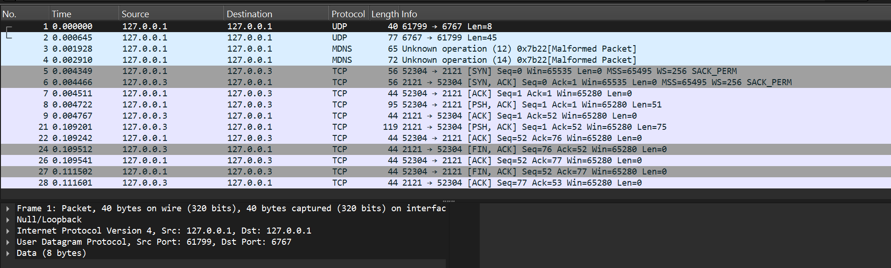
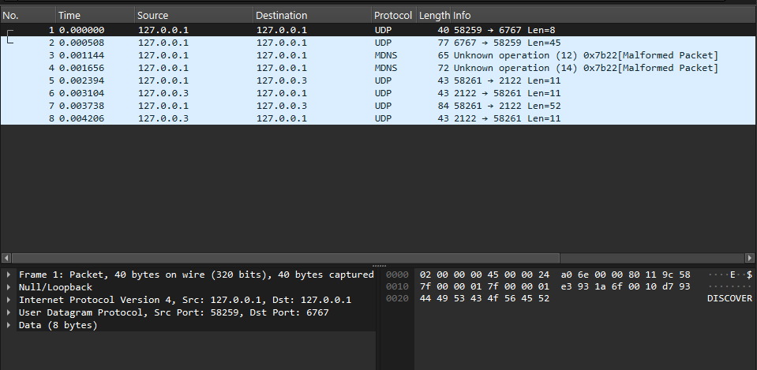
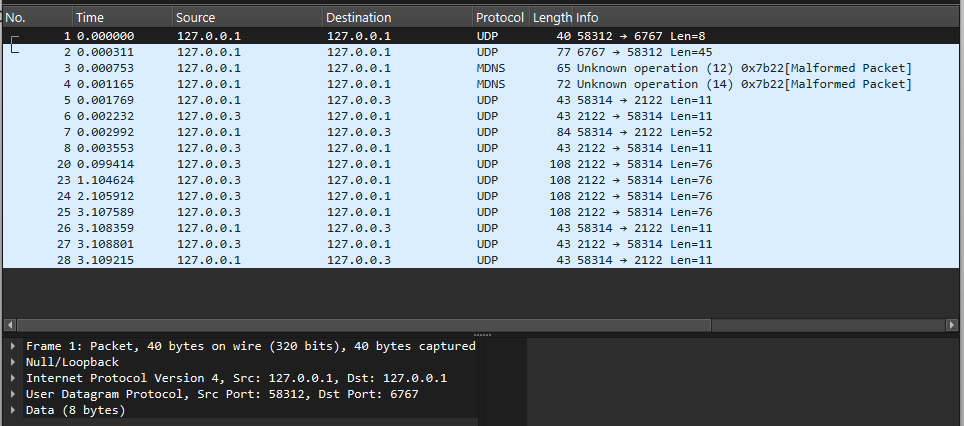
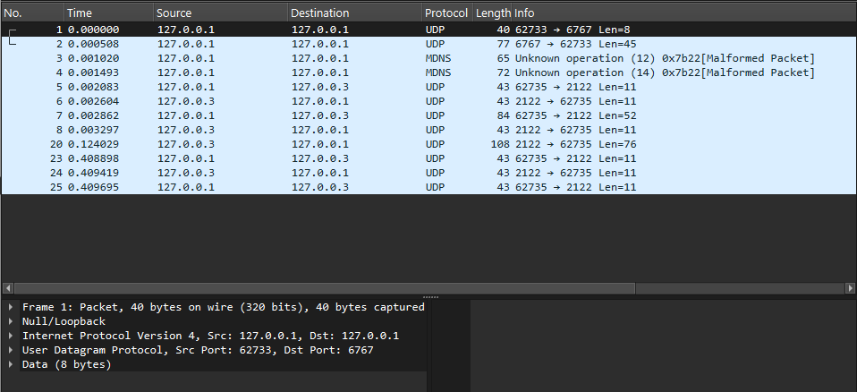

# Building a Network Protocol Stack from Scratch: An Educational Guide

## Overview & Educational Objective
This repository is designed as an educational deep-dive into low-level network architecture. Instead of relying on high-level libraries (like `requests` or `Flask`), this project builds a complete network ecosystem from the ground up using Python's bare-metal OS `socket` library. 

By reading and running this code, students can understand exactly how computers discover each other, resolve names, frame data, and guarantee delivery over unreliable connections.

---

## My Network Architecture

I separated the logic into small, independent files to simulate real, distinct network components:

| File | Role |
|---|---|
| `dhcp_server.py` | DHCP Server — assigns an IP address to the client via UDP. |
| `dns_server.py` | DNS Server — resolves `my-app-server.local` to an IP via UDP. |
| `app_server.py` | TCP App Server (HTTP Proxy) — receives a `FETCH` command and downloads the file over TCP. |
| `client.py` | TCP Client — runs the full sequence: DHCP → DNS → TCP fetch → save file. |
| `app_server_rudp.py` | RUDP App Server — same job as the TCP server but uses my custom reliable UDP protocol. |
| `client_rudp.py` | RUDP Client — same flow but uses my RUDP protocol for the transfer. |

### The Full Network Flow (Step by Step)

1. The client starts with no IP address. It sends a `DISCOVER` UDP message to the **DHCP Server** at `127.0.0.1:6767`. The server replies with `{"type": "OFFER", "assigned_ip": "127.0.0.2"}`.
2. Now that it has an IP, the client sends a JSON query `{"domain": "my-app-server.local"}` to the **DNS Server** at `127.0.0.1:5353`. The server replies with `{"status": "SUCCESS", "ip": "127.0.0.3"}`.
3. The client connects to the **App Server** at `127.0.0.3` and sends a `FETCH http://127.0.0.1:8080/test_file.txt` command.
4. The App Server downloads the file from the local HTTP server (`python -m http.server 8080`) and sends all the bytes back to the client.
5. The client saves the received file to disk — `downloaded_from_web.html` (TCP) or `downloaded_rudp.html` (RUDP).

---


---

## Module 1: Network Infrastructure

Before a client can download a file, it needs an identity (IP) and a way to find the server (DNS).

### 1. DHCP (Dynamic Host Configuration Protocol)
* **The Concept:** When a device joins a network, it has a physical MAC address but no IP address. A DHCP server dynamically leases an IP to the device.
* **The Implementation:** The `dhcp_server.py` listens on UDP port `6767` for `DISCOVER` broadcasts. It responds with a JSON `OFFER` containing an available IP (e.g., `127.0.0.2`).

### 2. DNS (Domain Name System)
* **The Concept:** Humans remember names (`example.local`), but networking hardware uses IP addresses (`127.0.0.3`). DNS translates names to IPs.
* **The Implementation:** The `dns_server.py` listens on UDP port `5353`. It acts as a directory, checking a hardcoded dictionary for the requested hostname and returning the mapped IP address.

---

## Module 2: The TCP Stream Problem & Framing

* **The Concept:** TCP is a continuous "stream" of bytes. If a server sends 1000 bytes, the client might receive it in chunks of 200, 500, and 300. How does the client know when the message is complete?
* **The Solution (Length-Prefix Framing):** In `app_server.py`, before sending the actual data, the server prepends a **10-byte, zero-padded header** representing the payload's exact size (e.g., `0000000065`). 
* The client (`client.py`) strictly reads these first 10 bytes, converts them to an integer, and keeps receiving data in a loop until exactly that many bytes are collected.

---

## Module 3: Reliable UDP (RUDP) - The Crown Jewel

UDP is fast but unreliable—it drops packets, scrambles order, and provides no delivery confirmation. This project builds a custom transport protocol (RUDP) over UDP to ensure absolute reliability.


### 1. The Custom Packet Header
Every data packet requires metadata to track its state. The `app_server_rudp.py` packs an 11-byte binary header using `struct.pack('!IIcH')`:
* **Sequence Number (4 bytes):** Identifies the packet's exact order.
* **Acknowledgment Number (4 bytes):** Confirms which packets were received.
* **Flags (1 byte):** Single characters dictating the packet type (`S` for SYN, `A` for ACK, `D` for DATA, `F` for FIN).
* **Payload Length (2 bytes):** The size of the attached data chunk.

### 2. Congestion Control (Go-Back-N & AIMD)
If a server blasts data faster than the network can handle, packets will be dropped. RUDP controls this flow:


* **Go-Back-N (GBN):** The server sends a "window" of packets without waiting for individual ACKs. If a timeout occurs (1 second) before receiving an ACK for the base packet, the server resets and retransmits the entire window from that base sequence.


* **AIMD (Additive Increase, Multiplicative Decrease):** The server dynamically adjusts its speed.
    * *Additive Increase:* For every successful ACK, the window size increases by 1 (capped at a maximum of 5).
    * *Multiplicative Decrease:* If a packet is lost (triggering a timeout), the window size is immediately divided by 2 to relieve network congestion.

---

## Module 4: Chaos Engineering (Simulating Reality)

To prove the RUDP protocol actually works, the client must act maliciously.
In `client_rudp.py`, we inject deliberate faults into the network:
* **Packet Loss (`SIMULATE_PACKET_LOSS = True`):** The client randomly ignores ~30% of incoming DATA packets, forcing the server to trigger its Go-Back-N timeout and retransmit.
* **Latency (`SIMULATE_LATENCY = True`):** Introduces random delays (`0.1` to `0.4` seconds) to test the server's timeout thresholds.

---

## Quick Start: Running the Simulation

Run the files in separate terminal windows in the following exact order to simulate a full network boot-up:

1. **Start the local HTTP server** (provides the payload to download):
   ```bash
   python -m http.server 8080

```

2. **Start the Infrastructure:**
```bash
python dhcp_server.py
python dns_server.py

```


3. **Start the Reliable Server:**
```bash
python app_server_rudp.py

```


4. **Run the Client:**
```bash
python client_rudp.py

```


---

## Protocol Validation & Wireshark Captures

To strictly validate the custom protocol implementation, congestion control algorithms, and overall network behavior, all traffic was captured on the local Loopback adapter. 

Below are the Wireshark screenshots and raw `.pcapng` capture files demonstrating the successful execution of all system phases, including connection establishment, packet loss recovery, and sliding window dynamics.

Wireshark filter used:
```
udp.port == 6767 or udp.port == 5353 or tcp.port == 2121 or udp.port == 2122
```

---

### 1. TCP Complete Flow

Shows the DHCP assignment, DNS resolution, and the full TCP proxy fetch with the framed response.



📥 **[Click here to download the raw Wireshark capture file (.pcapng)](captures/part1_flow.pcapng)**

---

### 2. RUDP Foundation & Handshake

Shows the custom SYN, SYN-ACK, and first DATA command exchange over raw UDP using the 11-byte binary header.



📥 **[Click here to download the raw Wireshark capture file (.pcapng)](captures/part2_flow.pcapng)**

---

### 3. RUDP Stop-and-Wait Clean Flow

Shows the full transfer with the custom 11-byte headers, a single data chunk, and the FIN packet, without any simulated packet loss.


📥 **[Click here to download the raw Wireshark capture file for the RUDP clean flow (.pcapng)](captures/part3_rudp_clean_flow.pcapng)**

---

### 4. RUDP Packet Loss & Recovery

Shows the server timing out and retransmitting the same chunk multiple times because the client's `SIMULATE_PACKET_LOSS` flag dropped the incoming DATA packets. Proves the Go-Back-N retransmission loop works correctly.



📥 **[Click here to download the raw Wireshark capture file for the RUDP packet loss flow (.pcapng)](captures/part4_rudp_loss_flow.pcapng)**

---

### 5. RUDP Advanced Flow (Sliding Window & Latency)

Shows the Go-Back-N sliding window session with delayed ACKs caused by the `SIMULATE_LATENCY` flag. The delay between each DATA chunk and its ACK is clearly visible in the packet timestamps.



📥 **[Click here to download the raw Wireshark capture file for the RUDP advanced flow (.pcapng)](captures/part5_rudp_advanced_flow.pcapng)**
